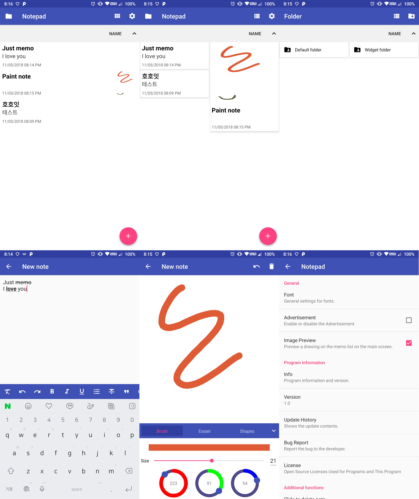

# OpenPad for Android Version 2
[](https://android-arsenal.com/api?level=19)[](http://www.apache.org/licenses/LICENSE-2.0)

## Features
```
 1) Low memory(Very light)
 2) There is no need for Internet connection.(but no sync function.)
 3) Just notepad
 4) Kotlin
```
## What's New? (Last updated 2020.10.13) - None Build
```
 1) Add Widget
```
## Lasted Update List
[View Lists](./UPDATE.md)
## Known Bugs
```
 1) Memory Leaks(Image Note Cache)
 2) Memory Leaks(Settings Preferences)
```
## Development environment
```
 Operating System : Windows 10 Pro 64bit
 CPU : AMD Ryzen 5 3600
 RAM : 32GB
 VGA : Radeon RX5700XT
 Android SDK(Min) : API 19
 Android SDK(Target and Compiled) : API 30
```
## License
Copyright 2020 Jeon Ye-Chan

Licensed under the Apache License, Version 2.0 (the "License");
you may not use this file except in compliance with the License.
You may obtain a copy of the License at
```
http://www.apache.org/licenses/LICENSE-2.0
```
Unless required by applicable law or agreed to in writing, software
distributed under the License is distributed on an "AS IS" BASIS,
WITHOUT WARRANTIES OR CONDITIONS OF ANY KIND, either express or implied.
See the License for the specific language governing permissions and
limitations under the License.
## Good Bye!!
Compiled by Android Studio 4.0.1